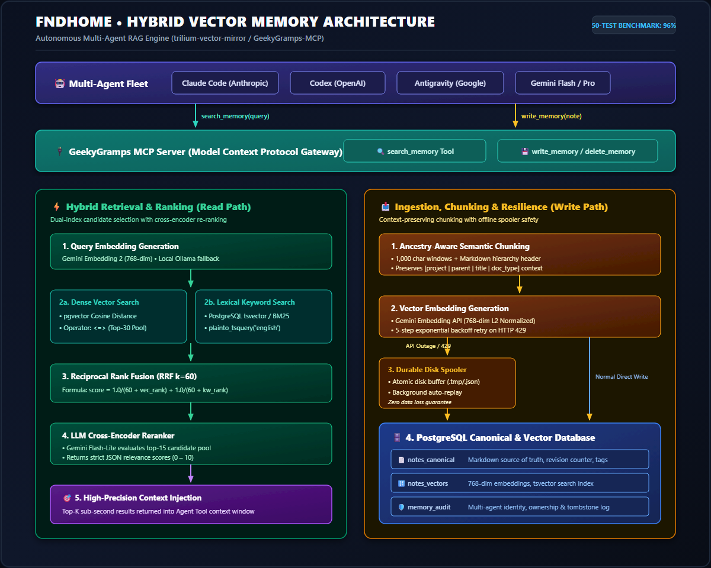
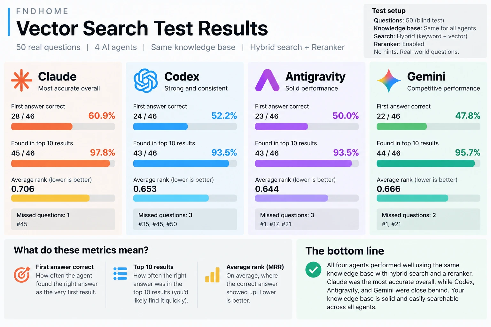

# Hybrid Vector Memory: Replacing a Hierarchical Note API with RAG


Migrated the shared memory layer for a fleet of four AI coding agents (Claude Code, Codex, Antigravity, Gemini) from a hierarchical note API to a hybrid retrieval-augmented memory engine, exposed through this MCP gateway as `search_memory`, `write_memory`, and `delete_memory`.



## Problem

As agents took on more operational work (multi-node k3s, Ceph, GitOps pipelines), the old note API failed in three ways:

1. **Rigid lookups.** Path-based retrieval missed when a query was descriptive rather than structurally exact.
2. **Context bloat.** Returning whole note trees burned token budget and added noise to agent reasoning.
3. **Write fragility.** Concurrent session captures from several agents contended on locks and failed outright when the external embedding API rate-limited.

## Design

### One MCP interface for every agent
All memory operations go through three MCP tools with enforced actor attribution, revision checking, and a tombstone audit log. Every harness sees the same schema.

### Ancestry-aware chunking
Documents are split into ~1,000-character windows, each prefixed with a hierarchy header:

`[project | parent_section | note_title | doc_type]`

A chunk retrieved out of sequence still carries its structural context.

### Hybrid retrieval (read path)
Two candidate searches run in parallel:

- **Dense:** cosine distance (`<=>`) over normalized 768-dim embeddings in PostgreSQL (`pgvector`). Top-30 pool.
- **Lexical:** PostgreSQL full-text search (`tsvector`, `plainto_tsquery`). Dense embeddings routinely miss exact identifiers such as hostnames, port numbers, and CRD versions; lexical search catches them.

Candidates are merged with Reciprocal Rank Fusion (k=60):

```
score = 1/(60 + rank_vec) + 1/(60 + rank_kw)
```

The fused top-15 then goes through an LLM cross-encoder reranker (Gemini Flash-Lite) that returns strict JSON relevance scores from 0 to 10. Only the top-K results enter the agent's context window. Query embedding uses Gemini Embedding 2 with a local Ollama fallback.

### Resilient writes (write path)
Embedding calls use a 5-step exponential backoff on HTTP 429. If the provider is still unavailable, the payload is staged atomically to disk (`.tmp` then `.json`) and a background worker replays it later. No write is lost to an upstream outage.

Storage is three PostgreSQL tables: a canonical Markdown source of truth with a revision counter, a vectors table (embeddings plus `tsvector` index), and a multi-agent audit/tombstone log.

## Validation

Before retiring the legacy store, a 50-question blind evaluation ran against the same knowledge base through all four agent harnesses, using hybrid search with the reranker enabled and no hints. 46 questions were scored per agent.



| Agent | First answer correct | Found in top 10 | MRR | Missed |
| :--- | :---: | :---: | :---: | :--- |
| Claude Code | 60.9% (28/46) | 97.8% (45/46) | 0.706 | #45 |
| Gemini | 47.8% (22/46) | 95.7% (44/46) | 0.666 | #1, #21 |
| Codex | 52.2% (24/46) | 93.5% (43/46) | 0.653 | #35, #45, #50 |
| Antigravity | 50.0% (23/46) | 93.5% (43/46) | 0.644 | #1, #17, #21 |

## Takeaways

- Dense-only retrieval is not enough for infrastructure knowledge; BM25-style lexical search is required for exact identifiers.
- A lightweight reranker is the cheapest precision win in the pipeline.
- A durable write spool keeps agent state intact through embedding-provider outages.

## Stack

PostgreSQL, `pgvector`, Google Gemini Embedding 2, Gemini Flash-Lite, Ollama, Node.js, Fastify, Model Context Protocol, k3s.

> This is a personal homelab project published for portfolio purposes. Deployment specifics are intentionally omitted.
